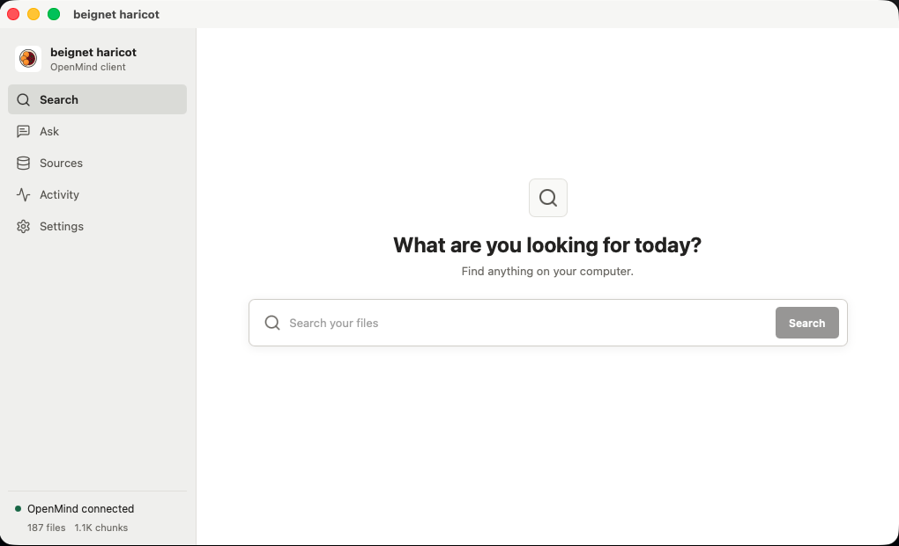
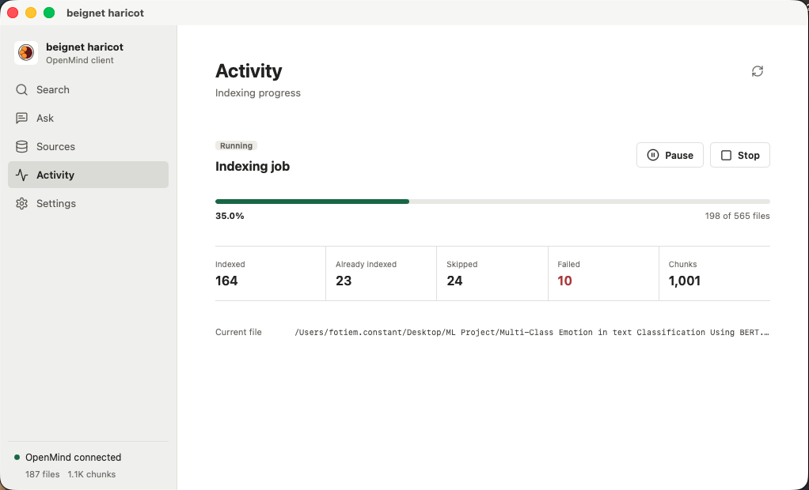

<div align="center">
  

  # beignet haricot

  A lightweight, cross-platform desktop client for [OpenMind](https://github.com/codewithbro95/openmind).

  [](https://github.com/codewithbro95/beignet-haricot/actions/workflows/ci.yml)
  [](https://github.com/codewithbro95/beignet-haricot/actions/workflows/release.yml)
  [](https://github.com/codewithbro95/beignet-haricot/releases/latest)
</div>

Beignet haricot gives OpenMind a focused native interface for searching local memory, asking source-grounded questions, managing approved folders, and monitoring indexing. OpenMind remains the local engine and API; this app is a small client built with Tauri v2, Preact, TypeScript, and Rust.

## Screenshots

### Search first

Search is the first screen and the fastest way to find indexed files. Results include match context, file details, safe file opening, and local image previews when available.



### Live indexing activity

Follow discovery and indexing progress, see what OpenMind is processing, and pause, resume, or stop the current job.



## Current Features

- Search indexed local files and open the original result.
- Preview supported indexed images without exposing broad filesystem access to the interface.
- Stream source-grounded Ask responses rendered as Markdown.
- Continue follow-up questions through temporary OpenMind conversation sessions.
- Enable model reasoning per turn and inspect streamed reasoning in a collapsible Thinking view.
- Add and remove user-approved source folders with the native folder picker.
- Start, pause, resume, stop, and monitor background indexing.
- Inspect OpenMind connection, provider, model, file, and chunk status.
- Configure a custom loopback API port while keeping requests local.

## Install

Download the installer for your platform from [GitHub Releases](https://github.com/codewithbro95/beignet-haricot/releases):

- macOS: universal `.dmg`
- Windows: NSIS `.exe` or `.msi`
- Linux: `.AppImage` or `.deb`

The current macOS and Windows builds are not production identity-signed, and the macOS build is not notarized. Your operating system may show a security warning until signing is added.

## Connect OpenMind

beignet haricot requires OpenMind to be set up and serving its authenticated local API. Install and configure [OpenMind](https://github.com/codewithbro95/openmind), then start it:

```bash
openmind serve
```

The app connects to `http://127.0.0.1:8765` by default. A different loopback port can be configured from Settings.

## Run From Source

### Requirements

- Node.js 20 or newer
- Rust 1.77.2 or newer
- The platform dependencies from the [Tauri v2 prerequisites](https://v2.tauri.app/start/prerequisites/)
- OpenMind configured and running locally

Install dependencies and start the native development app:

```bash
npm install
npm run tauri dev
```

Create a production bundle for the current platform:

```bash
npm run tauri build
```

Run the same frontend and Rust checks used during development:

```bash
npm run check
cargo test --manifest-path src-tauri/Cargo.toml
cargo clippy --manifest-path src-tauri/Cargo.toml --all-targets -- -D warnings
```

## Security

The webview never receives or reads the OpenMind bearer token. The Rust layer reads `~/.openmind/api_token` and sends authenticated requests directly to the local OpenMind API.

The native bridge:

- accepts only `http://127.0.0.1` addresses
- follows no redirects
- exposes only documented OpenMind operations
- validates session and document identifiers
- grants no shell or broad filesystem access to the webview
- allows only the bundled `main` window to call the bridge

Original files remain under the user's control. Opening and image preview operations are restricted to files already indexed inside enabled OpenMind sources.

## App Identity And Version

The app name, version, identifier, and description have one source of truth:

```text
app.config.json
```

After changing it, synchronize npm, Cargo, Tauri, and HTML metadata:

```bash
npm run sync:config
```

Development and build commands run this synchronization automatically.

## Releases

Development work targets `develop`. A new version in `app.config.json`, paired with a matching `CHANGELOG.md` section, is released after it reaches `main`.

GitHub Actions verifies the project and builds macOS, Windows, and Linux independently. The first successful platform publishes the release, and installers from other successful platforms are attached as their builds finish. A failure on one platform does not block downloads produced by another.

See [RELEASING.md](RELEASING.md) for versioning, branch, and signing details.

## Project Structure

```text
app.config.json          app identity and version
assets/screenshots/      README product screenshots
src/                     Preact interface and typed API client
src-tauri/src/           constrained Rust API bridge
src-tauri/capabilities/  Tauri security permissions
src-tauri/icons/         cross-platform application icons
scripts/                 metadata and release helpers
```
